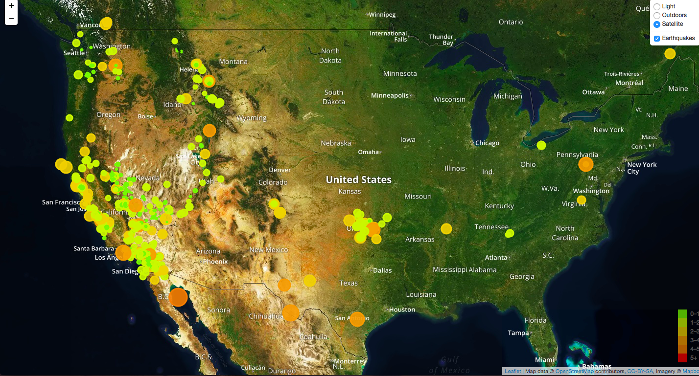

# Earthquake Geomapping

## Background

The USGS is responsible for providing scientific data about natural hazards, the health of our ecosystems and environment; and the impacts of climate and land-use change. Their scientists develop new methods and tools to supply timely, relevant, and useful information about the Earth and its processes. This project uses Leaflet to map earthquakes all over the world.

### Earthquake Map

1. **Getting the data set**

   

   The USGS provides earthquake data in a number of different formats, updated every 5 minutes. The [USGS GeoJSON Feed](http://earthquake.usgs.gov/earthquakes/feed/v1.0/geojson.php) page provides different data to choose from. Each data set gives a JSON representation of that data. The data set used here was for [all earthquakes within the past 7 days](https://earthquake.usgs.gov/earthquakes/feed/v1.0/summary/all_week.geojson).

   

2. **Import & Visualize the Data**

   Created a map using Leaflet that plots all of the earthquakes from the data set based on their longitude and latitude.

   * Data markers reflect the magnitude of the earthquake in their size and color. Earthquakes with higher magnitudes appear larger and darker in color.

   * Popups provide additional information about the earthquake when a marker is clicked.

   * A legend for the earthquake magnitude.

* Added a number of base maps to choose from.

* Added layer controls to the map.

## How to Run the App:
* Create a Mapbox access token: https://docs.mapbox.com/help/how-mapbox-works/access-tokens/
* Insert token into [config.js](config.js)
* `python -m http.server`
* Paste URL link into browser